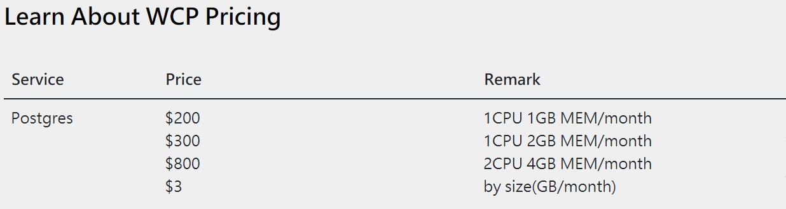

# Service Name : 
### RDS

# Service Description:
### RDS makes it easy to set up, operate, and scale a PostgreSQL database.It provides cost-efficient and resizable capacity while automating time-consuming administration tasks such as hardware provisioning, database setup, patching and backups. It frees you to focus on your applications so you can give them the fast performance, high availability, security and compatibility they need.

# Service Provider:
### On-premise

# Availability:
### RDS provide auto fail-over standby and manual/auto backup for your instance.

# Ordering Procedure:
### You can apply the RDS via power automate form [Armstrong Resource apply form](https://forms.office.com/Pages/ResponsePage.aspx?id=4JUH3sDX6065u7yU2JgNO9vf9rZ172tAq9QTVe6mazRUQVhNUFpWMkdWWUMxMFVJV0Y1OE5NSlk2MC4u&fswReload=1&fswNavStart=1630979690392) and you can use it directly after approval.

# Pricing and Chargeback:
### Please referenece below pricing table
 

# SLAs:
### When your service enabled HA function, we guarantee 99.95% service uptime. When you are using single database,we just guarantee you best effort(Use PIRT function to restore your database).

# Service Representative:
### If you have any concern,you can contact with Richard Lai(8500-31886)

# Miscellaneous:
### You can learn more about RDS in [WCP](https://wcp.wistron.com/Documentation/PostgreSQL/#/)
